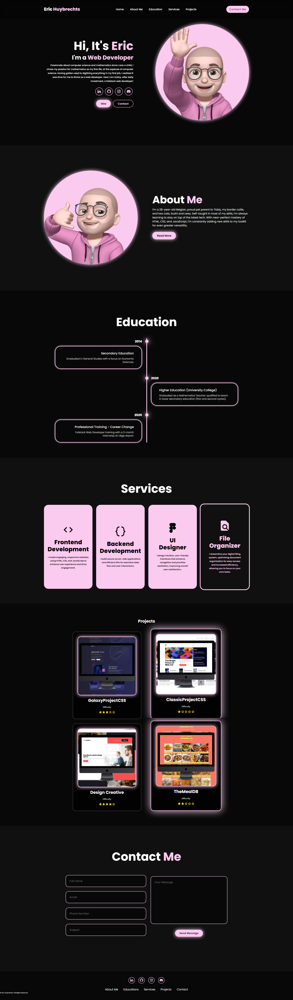

<h1 align="center"> 🌟 First Portfolio 🌟 </h1>

### 🌐 Demo / Preview


---

### ✏️ **Description**
This project is my very first portfolio, created as a test to see if everything I envisioned was possible and visually appealing.  

Being a first attempt, it is limited in terms of technology and built using **HTML**, **SCSS**, and **JavaScript**. As a result:
- The **HTML** is quite heavy and contains a lot of information.
- The **SCSS** is well-organized but has room for improvement.
- The **JavaScript** is classic yet clean, well-commented, and structured.

For a more advanced version built in React, check out the improved version on my GitHub: [Portfolio React](https://github.com/HUYBERIC/portfolio-react).

### 💻 **Technologies Used**
- **HTML5**: For structuring the content.
- **SCSS**: For styling and maintaining a clean structure.
- **JavaScript**: For basic interactivity, with well-commented code.

### **Key Features** 🚀
🎨 Aesthetic design: Focused on testing visual appeal.

💡 Beginner-friendly structure: A good first step into portfolio creation.

⚙️ Clean organization: Comments and structure in JavaScript and SCSS for clarity.

### 🛠️ **Installation & Usage**
1. Clone the repository:
   ```bash
   git clone https://github.com/HUYBERIC/PortfolioV1.git
   cd PortfolioV1
   ```

2. Open `index.html` in your favorite browser to view the portfolio.

<br>
<br>
<br>

---

<h1 align="center"> 🌟 Premier Portfolio 🌟 </h1>

---

### ✏️ **Description**
Ce projet est mon tout premier portfolio, créé comme un test pour vérifier si tout ce que je souhaitais inclure était possible et esthétique.  

Étant une première tentative, il est limité en termes de technologies et construit en **HTML**, **SCSS**, et **JavaScript**. Par conséquent :
- Le **HTML** est assez lourd et contient beaucoup d’informations.
- Le **SCSS** est bien organisé mais perfectible.
- Le **JavaScript** est classique mais propre, bien commenté, et structuré.

Pour une version améliorée construite avec React, consultez la version évoluée sur mon GitHub : [Portfolio React](https://github.com/HUYBERIC/portfolio-react).

### 💻 **Technologies utilisées**
- **HTML5** : Pour structurer le contenu.
- **SCSS** : Pour le style et une structure propre.
- **JavaScript** : Pour l’interactivité basique, avec un code bien commenté.

### **Caractéristiques principales** 🚀
🎨 Design esthétique : Focalisé sur le test de l’attrait visuel.

💡 Structure débutant : Une bonne première étape dans la création de portfolio.

⚙️ Organisation claire : Commentaires et structure dans le JavaScript et le SCSS pour plus de lisibilité.

### 🛠️ **Installation & Utilisation**
1. Cloner le dépôt :
   ```bash
   git clone https://github.com/HUYBERIC/PortfolioV1.git
   cd PortfolioV1
   ```

2. Ouvrir `index.html` dans votre navigateur favori pour voir le portfolio.
